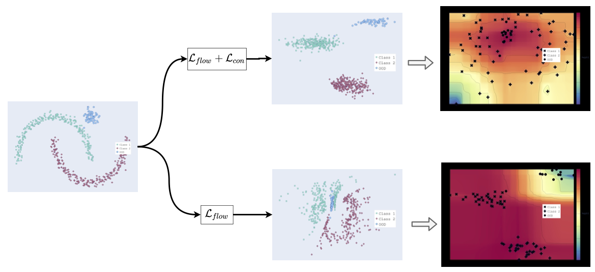
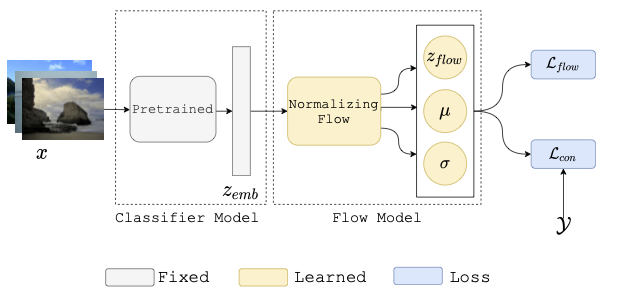
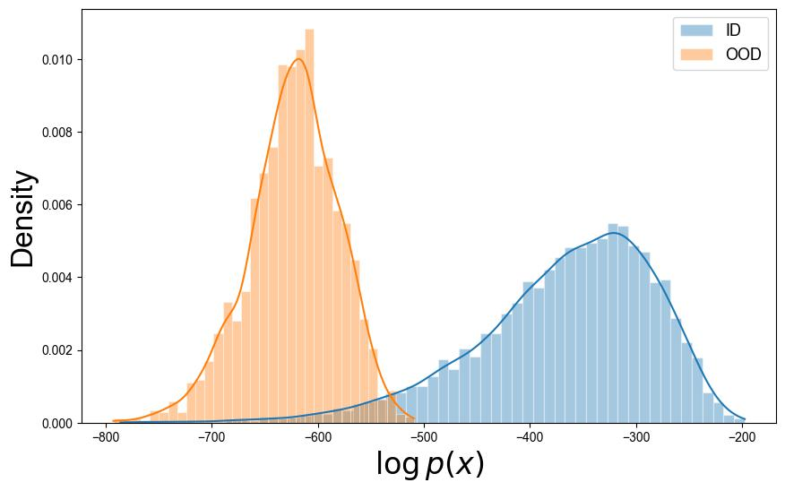
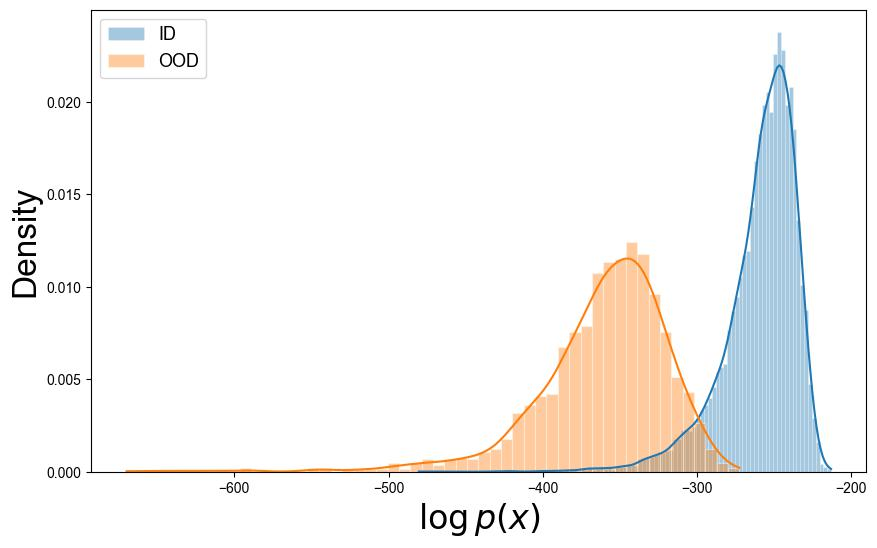

# [ECCV'24] FlowCon: Out-of-Distribution Detection using Flow-Based Contrastive Learning

<!-- :book: Paper: [`ECCV'24`]Bandara_AdaMAE_Adaptive_Masking_for_Efficient_Spatiotemporal_Learning_With_Masked_Autoencoders_CVPR_2023_paper.pdf) and [``arXiv``] -->

### :bulb: Contributions:


- A new density-based OOD detection technique called FlowCon is proposed. We introduce a new loss function $L_{con}$ which contrastively learns class separability in the probability distribution space. This learning occurs without any external OOD dataset and it operates on fixed classifiers.

- The proposed method is evaluated on various metrics - FPR95, AUROC, AUPR-Success, and AUPR-Error and compared against state of the art. We observe that FlowCon is competitive or outperforms most methods under different OOD conditions. Additionally, FlowCon is stable even for a large number of classes and shows improvement for high-dimensional features

- Histogram plots are detailed along with unified manifold approximations (UMAP) embeddings of the trained FlowCon model to respectively showcase it’s OOD detection and class-preserving capabilities. We also show FlowCon’s discriminative capabilities.


### Method


<!-- ### FAR-OOD likelihood plots when $D_{in}=CIFAR10$ on ResNet-18 and WideResNet models. -->
<!--  -->
<!--  --> 

<!-- 
### Adaptive mask visualizations from $SSv2$ (samples from $50th$ epoch)

| &nbsp; Video &nbsp;  | Pred. &nbsp;| &nbsp; Error &nbsp; | &nbsp; &nbsp; CAT &nbsp; | Mask | &nbsp; |  Video  | Pred. &nbsp;| &nbsp; Error &nbsp; | &nbsp; &nbsp; CAT  &nbsp; | Mask &nbsp; |
| ----------- | --------- | --------- | --------- | --------- |--|--------- | --------- | --------- | --------- | --------- |

<p float="left">
  
   
</p>
<p float="left">
  
   
</p>
<p float="left">
  
   
</p>
<p float="left">
  
   
</p>
<p float="left">
  
   
</p>
<p float="left">
  
   
</p>

### Adaptive mask visualizations from $K400$ (samples from $50th$ epoch):

| &nbsp; Video &nbsp;  | Pred. &nbsp;| &nbsp; Error &nbsp; | &nbsp; &nbsp; CAT &nbsp; | Mask | &nbsp; |  Video  | Pred. &nbsp;| &nbsp; Error &nbsp; | &nbsp; &nbsp; CAT  &nbsp; | Mask &nbsp; |
| ----------- | --------- | --------- | --------- | --------- |--|--------- | --------- | --------- | --------- | --------- |

<p float="left">
  
   
</p>
<p float="left">
  
   
</p>
<p float="left">
  
   
</p>
<p float="left">
  
   
</p>
<p float="left">
  
   
</p>
<p float="left">
  
   
</p>

### A comparision

Comparison of our adaptive masking with existing random *patch*, *tube*, and *frame* masking for masking ratio of 80\%.} Our adaptive masking approach selects more tokens from the regions with high spatiotemporal information while a small number of tokens from the background.


## Ablation experiments on SSv2 dataset:

We use ViT-Base as the backbone for all experiments. MHA $(D=2, d=384)$ denotes our adaptive token sampling network with a depth of two and embedding dimension of $384$.  All pre-trained models are evaluated based on the evaluation protocol described in Sec. 4. The default choice of our *Ada*MAE is highlighted in gray color. The GPU memory consumption is reported for a batch size of 16 on a single GPU.


# Pre-training *Ada*MAE & fine-tuning:

- We closely follow the [VideoMAE](https://github.com/MCG-NJU/VideoMAE.git) pre-trainig receipy, but now with our *adaptive masking* instead of *tube masking*. To pre-train *Ada*MAE, please follow the steps in [``DATASET.md``](readme/DATASET.md), [``PRETRAIN.md``](readme/PRETRAIN.md).

- To check the performance of pre-trained *Ada*MAE please follow the steps in [``DATASET.md``](readme/DATASET.md) and [``FINETUNE.md``](readme/FINETUNE.md).

- To setup the conda environment, please refer [``FINETUNE.md``](readme/INSTALL.md).

# Pre-trained model weights

- Download the pre-trained model weights for SSv2 and K400 datasets [``here``](https://github.com/wgcban/adamae/releases/tag/v1).

## Acknowledgement:
Our AdaMAE codebase is based on the implementation of VideoMAE paper. We thank the authors of the [VideoMAE](https://github.com/MCG-NJU/VideoMAE.git) for making their code available to the public.


## Citation:
```
@InProceedings{Bandara_2023_CVPR,
    author    = {Bandara, Wele Gedara Chaminda and Patel, Naman and Gholami, Ali and Nikkhah, Mehdi and Agrawal, Motilal and Patel, Vishal M.},
    title     = {AdaMAE: Adaptive Masking for Efficient Spatiotemporal Learning With Masked Autoencoders},
    booktitle = {Proceedings of the IEEE/CVF Conference on Computer Vision and Pattern Recognition (CVPR)},
    month     = {June},
    year      = {2023},
    pages     = {14507-14517}
}
``` -->