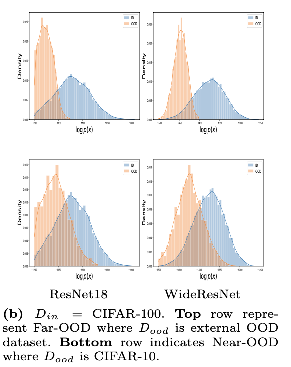
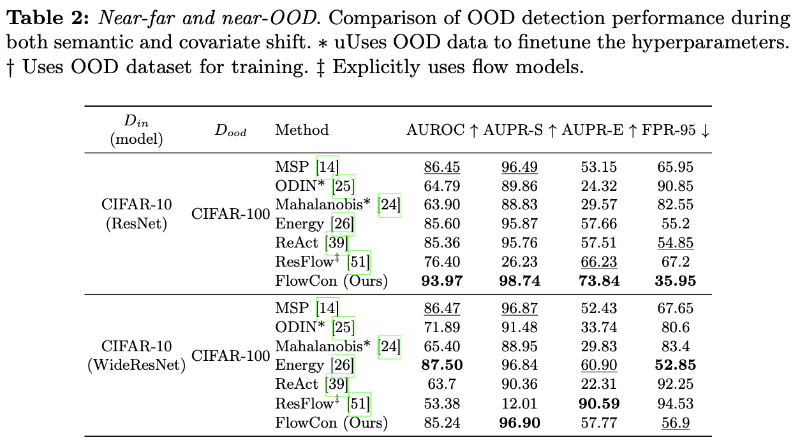
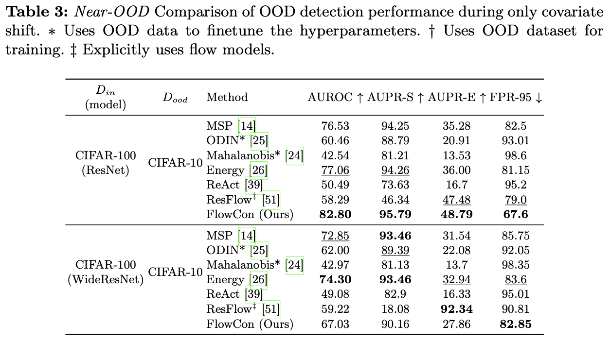

  <h2 align="center"><strong>FlowCon: Out-of-Distribution Detection using Flow-Based Contrastive Learning</strong></h2>

  <h3 align="center"><strong>ECCV 2024</strong>
  </h3>

  

    <a href="https://saandeepa93.github.io/"><strong> Saandeep Aathreya</strong></a>,
    <a href="https://scanavan.github.io/"><strong> Shaun Canavan</strong></a>
     
    <strong> University of South Florida, USA</strong>.
     
  

   

## :bulb: **Contributions**:

  

<!--  -->

- A new density-based OOD detection technique called FlowCon is proposed. We introduce a new loss function $L_{con}$ which contrastively learns class separability in the probability distribution space. This learning occurs without any external OOD dataset and it operates on fixed classifiers.

- The proposed method is evaluated on various metrics - FPR95, AUROC, AUPR-Success, and AUPR-Error and compared against state of the art. We observe that FlowCon is competitive or outperforms most methods under different OOD conditions. Additionally, FlowCon is stable even for a large number of classes and shows improvement for high-dimensional features

- Histogram plots are detailed along with unified manifold approximations (UMAP) embeddings of the trained FlowCon model to respectively showcase it’s OOD detection and class-preserving capabilities. We also show FlowCon’s discriminative capabilities.

## **Results**

### **FAR-OOD likelihood plots when $D_{in}=CIFAR10$ on ResNet-18 and WideResNet models**

  

### **FAR-OOD likelihood plots when $D_{in}=CIFAR100$ on ResNet-18 and WideResNet models**

  

## **FlowCon Comparison for Semantic and Covariate Shift**

 

  

  
  

<!-- 

  

  

 -->

## **UMAP Embeddings for Semantic and Covariate Shift**

  

  

## **Usage**
`COMING SOON`

## **Pre-trained model weights**

 `COMING SOON`

